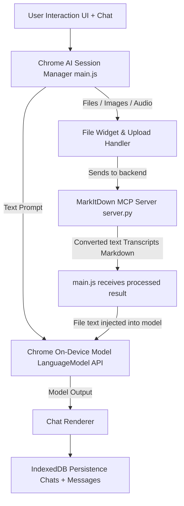
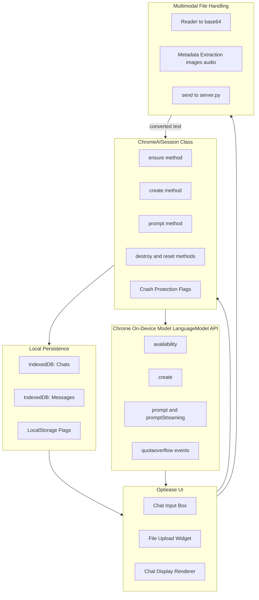
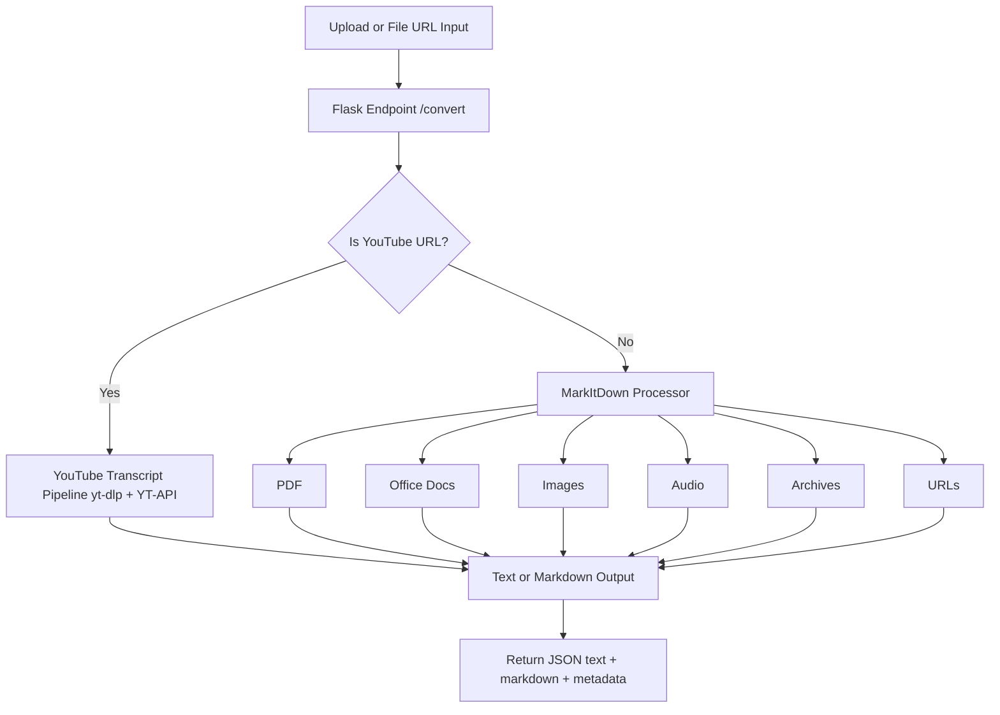

# **Optiease AI – Local Chrome AI + MarkItDown MCP Server**

This repository hosts the **Optiease AI Web Client** powered by Chrome's **on-device AI model**, and the backend **MarkItDown MCP Server** for multimodal file conversion, YouTube transcript extraction, and document processing.

**🔍 Check your Chrome AI model status:** [chrome://on-device-internals/](chrome://on-device-internals/)

The system provides a robust, ChatGPT-style experience with:

- 🧠 **Local on-device inference via Chrome AI**
- 🔧 **Crash-proof session management**
- 📄 **Full MarkItDown file ingestion pipeline**
- 🎬 **YouTube transcript extraction (yt-dlp + youtube-transcript-api)**
- 💬 **Persistent chat history (IndexedDB + optional server)**
- 🖼️ **Full multimodal support (images, audio, PDFs, Office docs)**
- 🟩 **Modern, branded UI with Open Sans typography**

---

# **1. Project Structure**

```
/web-client
    main.js           ← Chrome AI session manager & UI logic  (frontend)

 /server
    server.py         ← MarkItDown MCP Flask server (backend)
    storage_config.json
```

Your front-end code lives in `main.js` and communicates with the backend Flask server described in `server.py`.

- `main.js` manages Chrome’s on-device Language Model, crash states, file ingestion, chat history, UI events, multimodal prompting, and robustness mechanisms.
- `server.py` processes uploads, extracts YouTube transcripts, runs MarkItDown conversions, and returns markdown/text content.

---

# **2. System Architecture (High Level)**

Below is the **full pipeline**, from user input → Chrome AI → file processing → final chat output.



---

# **3. Frontend Architecture (main.js)**

`main.js` is a **self-healing Chrome AI session manager** with UI + storage + multimodal support.

## **Mermaid Diagram – Chrome AI Frontend**



### **Core Responsibilities**

- Creates AI session with minimal crash-safe configuration
- Tracks "permanently disabled" states to prevent Chrome lockouts
- Handles streaming / non-streaming prompts
- Processes image/audio/PDF/doc files
- Stores chats/messages in IndexedDB
- Manages session resets when switching chats
- Coordinates with the MarkItDown server

---

# **4. Backend Architecture (server.py)**

The backend is a **Flask + MarkItDown** server that handles:

- File → Markdown/Text extraction
- YouTube → Transcript extraction
- URL → Content extraction
- Server-side session storage (optional)
- Safe file sanitization & error handling

## **Mermaid Diagram – MarkItDown MCP Server**



### **Core Features**

- Robust YouTube transcript extraction
- MarkItDown-based universal document conversion
- Storage path configuration
- Detailed logging
- Clean filename sanitization
- Uniform output API

---

# **5. Getting Started**

## **Backend Setup**

### **Quick Start (Recommended)**

Use the automated setup scripts that handle everything for you:

**On Windows:**

```bash
setup.bat
```

**On macOS/Linux:**

```bash
chmod +x setup.sh
./setup.sh
```

**Universal Python Script (All platforms):**

```bash
python3 setup.py
```

These scripts will:

- ✓ Check Python installation
- ✓ Create virtual environment
- ✓ Install all dependencies
- ✓ Start the server automatically

---

### **Manual Setup (Advanced)**

If you prefer manual installation:

### **1. Install dependencies**

```bash
pip install flask flask-cors "markitdown[all]" youtube-transcript-api yt-dlp
```

### **2. Run the server**

```bash
python server.py
```

### **Default Endpoint**

```
POST http://localhost:5000/convert
```

Accepts:

- `multipart/form-data` → `file=`
- JSON → `{ "url": "https://..." }`

---

## **Frontend Setup**

The client is fully browser-based.

### **1. Open Chrome Canary (recommended)**

Check your model status at [chrome://on-device-internals/](chrome://on-device-internals/)

Enable the flag at `chrome://flags/#optimization-guide-on-device-model`.

### **2. Serve your app**

Any static server works:

```bash
python3 -m http.server 8000
```

### **3. Load index.html**

Chrome will download the 1–2GB on-device model automatically.

---

# **6. Key Features**

### **✔ Local on-device AI**

No API keys. No server load. 100% local inference.

### **✔ Crash-proof session manager**

Permanently disables itself after Chrome crash lockouts and prevents retry loops.
(From `ChromeAISession` in `main.js`)

### **✔ Full multimodal support**

- Images (metadata extraction)
- Audio (duration detection)
- YouTube videos (transcripts)
- PDFs, Word, Excel, PowerPoint
- HTML, JSON, CSV, Markdown

### **✔ IndexedDB persistence**

Chats + messages survive reloads.

### **✔ ChatGPT-style UI**

Regeneration buttons, file bubbles, icons, left/right message alignment.

---

# **7. API Summary**

### **Frontend → Backend**

```
POST /convert
```

### Response

```json
{
  "success": true,
  "text": "... extracted text ...",
  "markdown": "... markdown output ...",
  "title": "Document Title",
  "type": "youtube" | "pdf" | "docx" | ...
}
```

---

# **8. File References**

This README directly references the following project files:

- **Frontend: main.js** – Crash-proof Chrome AI Session Manager, file handling, chat system.

- **Backend: server.py** – MarkItDown MCP server for file and YouTube conversion.

---

# **9. License**

MIT License — free for commercial and personal use.
